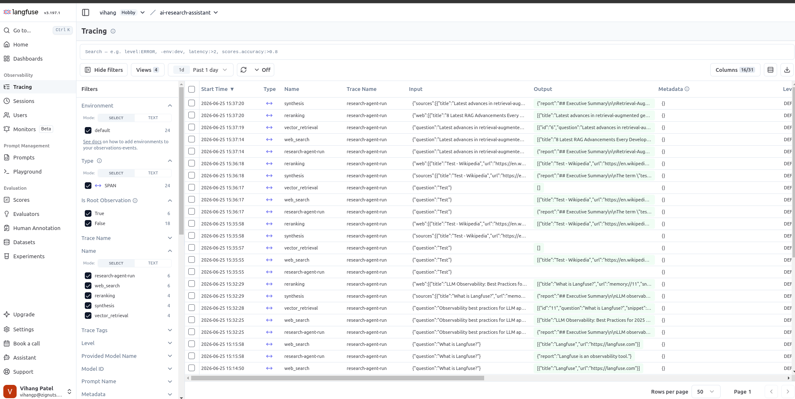

# AI Research Assistant

Production-style research app: React UI, Express API, LangGraph-ready agent pipeline, Postgres (pgvector) memory, Langfuse tracing.

## Quick start

```bash
npm install
npm run db:up
cp .env.example .env          # add API keys
npm run dev:server            # :3001
npm run dev:web               # :8001
```

Frontend: set `VITE_USE_MOCK=false` in `apps/web/.env` to use the API.

## Monorepo

| Path | Description |
|------|-------------|
| `apps/web` | React + custom directives (`AiStream`, `AiLoading`, `AiRetry`) |
| `apps/server` | Express + agent pipeline |
| `packages/shared-types` | Shared SSE / agent types |
| `docs/BACKEND.md` | API & agent details |

## Agent modes

- **Stub** — no API keys; fast mock SSE (dev/demo)
- **Live** — Tavily + Google Gemini (report + embeddings) + Postgres (pgvector)

## Deploy on Render (GitHub)

This repo includes [`render.yaml`](render.yaml) for a **Blueprint** with two services:

| Render resource | What it runs |
|-----------------|--------------|
| `ai-research-api` (Web Service, Node) | Express API (`apps/server`) |
| `ai-research-web` (Static Site) | React UI (`apps/web/dist`) |

After the first deploy, verify Postgres connection and extensions (Render shell or locally with production `POSTGRES_URL`):

```bash
npm run db:init --workspace=server
```

**Postgres is not bundled on Render Web Services.** Use [Supabase](https://supabase.com) or [Render Postgres] (free tier), then set `POSTGRES_URL` on the API service.

### Steps

1. Push this repo to GitHub.
2. In [Render](https://dashboard.render.com) → **New** → **Blueprint** → connect the repo.
3. Render reads `render.yaml` and creates both services.
4. When prompted, set secrets on **ai-research-api**:
   - `POSTGRES_URL` — Database connection string
   - `TAVILY_API_KEY`, `GEMINI_API_KEY` (optional `GEMINI_API_KEY_2`)
5. Wait for both deploys to finish.
6. Open **ai-research-web** URL. API health: `https://ai-research-api.onrender.com/api/health`

If you rename the static site in Render, update `CORS_ORIGIN` on the API to match its `https://…onrender.com` URL.

**Note:** Free Web Services sleep after inactivity; the first request may take ~30s to wake up. SSE research requests need the API awake for the full stream.

## Langfuse Tracing


## Walkthrough Demo
[Watch the Walkthrough Demo on Loom](https://www.loom.com/share/265e0ee60b2e4c468be842207f28b2f4)
